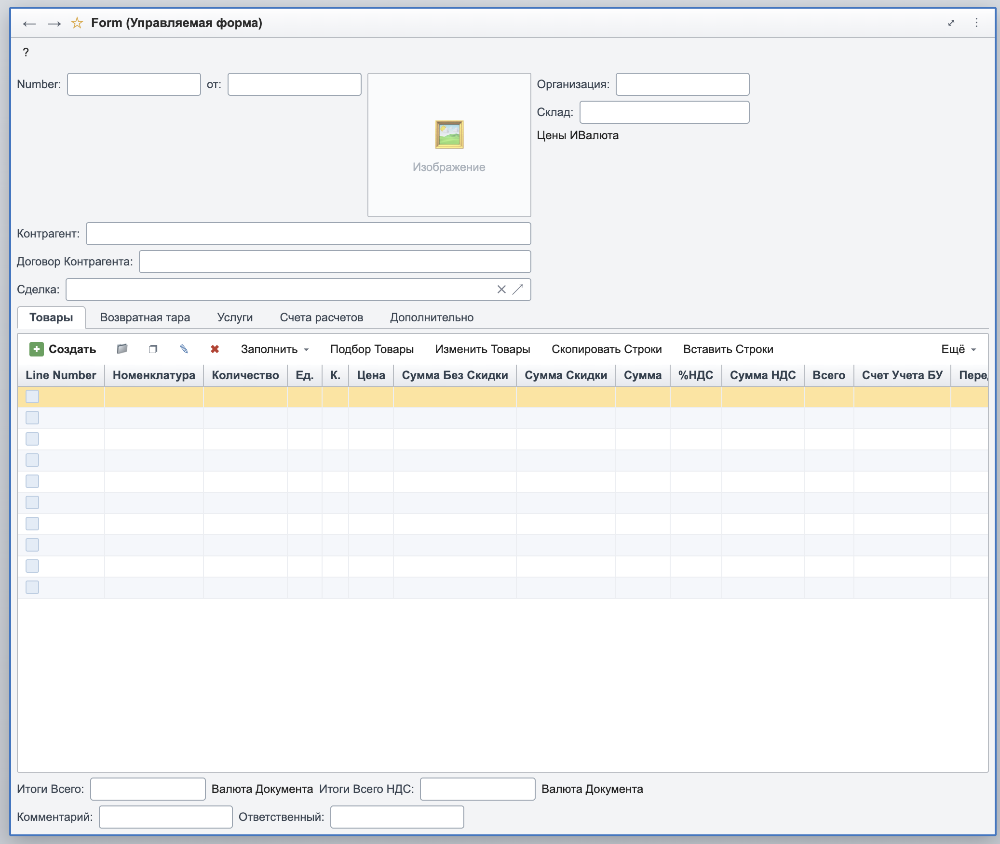
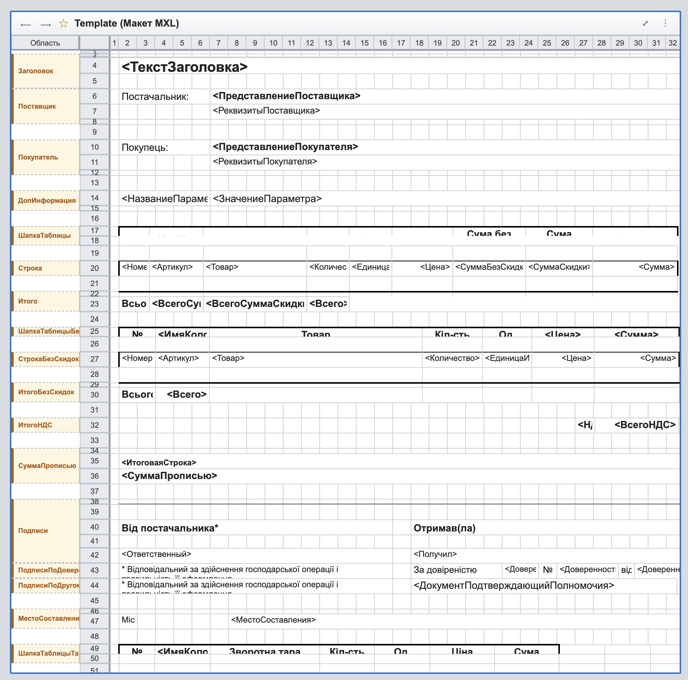

# 1C Managed Form Viewer for Visual Studio Code

A powerful Visual Studio Code extension for previewing, inspecting, and navigating **1C:Enterprise (1С:Предприятие)** configuration metadata files, including Managed Forms, Ordinary Forms, MXL Spreadsheet Templates, and BSL code.



---

## ✨ Key Features

### 1. 🖼️ Form & Template Visualizer
- **Managed Forms (`Form.xml`)**: Renders managed form interfaces with true-to-life 1C UI elements (groups, fields, tables, command bars, buttons, decorations, pages/tabs, and item hierarchies).
- **Ordinary Forms (`form.data` / descriptor `Form.xml`)**: Visualizes classic 1C ordinary forms parsed directly from 1C binary format descriptors.
- **Spreadsheet Documents / Templates (`Template.xml` / `.mxl`)**: Renders complex 1C spreadsheet tables with cell formatting, borders, merged cells, headers, drawings/charts, and section names.
- **Live Preview & Hot Reload**: Automatically refreshes webview previews as you edit or save your XML files.
- **Custom Editor Support**: Opens directly via standard editor tabs or side-by-side preview panels.

| 📋 Managed Form Preview | 📊 MXL Spreadsheet Template |
| :---: | :---: |
|  |  |

### 2. 🌲 1C Project Explorer Sidebar
- **Hierarchical Metadata Tree**: Groups all discovered forms, ordinary forms, and templates by 1C metadata classes:
  - Catalogs (*Справочники*)
  - Documents (*Документы*)
  - Data Processors (*Обработки*)
  - Reports (*Отчеты*)
  - Information / Accumulation / Accounting Registers (*Регистры сведений / накопления / бухгалтерии*)
  - Business Processes & Tasks (*Бизнес-процессы и задачи*)
  - Charts of Accounts / Calculation Types / Characteristic Types (*Планы счетов / видов расчета / видов характеристик*)
  - Exchange Plans, Constants, Web Services, and more.
- **Instant Search & Filter**: Filter metadata elements and forms across large configurations in real-time.
- **1C File Decorations & Badges**: Distinct badges (`СП`, `ДК`, `ОБ`, `ОТ`, `РС`, `РН`, etc.) and native 1C icons in your file explorer.

### 3. ⚡ Smart Navigation
- **Toggle Code / Form (`1c-form-viewer.toggleCodeForm`)**: Switch instantly between the visual form descriptor (`Form.xml`) and its corresponding module code (`Module.bsl`) with a single click or command.

### 4. 📝 1C BSL (1C:Enterprise Language) Support
- **Syntax Highlighting**: Comprehensive grammar support for 1C BSL / OneScript files (`.bsl`, `.os`) in both Russian and English syntax.
- **Document Outline & Symbols**: View procedures and functions in the VS Code Outline view (`Ctrl+Shift+O` / `Cmd+Shift+O`).
- **Occurrences & Highlights**: Precise word highlighting for read/write variable access with full Cyrillic identifier support.
- **Find References & Rename**: Find symbol usages across the active document and perform safe in-file renaming.
- **Semantic Highlighting**: Rich tokenization for parameters, local variables, and declarations.

---

## 🚀 Getting Started

### Installation
Install the extension from the VS Code Marketplace or package and install from VSIX:
```bash
code --install-extension 1c-form-viewer-0.2.1.vsix
```

### Usage
1. Open any 1C project or exported configuration folder in VS Code.
2. **Open Preview**:
   - Right-click on a `Form.xml`, `form.data`, or `Template.xml` in Explorer and choose **"1С: Показать форму / макет"**.
   - Or click the preview icon in the top-right editor title bar.
   - Or use the keyboard shortcut `Ctrl+Alt+F` (`Cmd+Alt+F` on macOS).
3. **Browse Metadata**: Open the **1С: Формы** activity bar tab on the left sidebar to explore and filter all forms in your project.
4. **Switch to Code**: Click **"1С: Переключить Код / Форму"** in the editor toolbar to jump straight to the form's `Module.bsl`.

---

## ⌨️ Commands & Keybindings

| Command | Title | Keybinding | Context |
|---|---|---|---|
| `1c-form-viewer.openPreview` | 1С: Показать форму / макет | `Ctrl+Alt+F` (`Cmd+Alt+F`) | XML / form / template files |
| `1c-form-viewer.toggleCodeForm` | 1С: Переключить Код / Форму | — | XML or BSL editor toolbar |
| `1c-form-viewer.refreshProjectForms` | Обновить список форм | — | Sidebar toolbar |
| `1c-form-viewer.filterProjectForms` | Фильтровать список | — | Sidebar toolbar |
| `1c-form-viewer.clearProjectFormsFilter` | Очистить фильтр | — | Sidebar toolbar |

---

## 🛠️ Supported File Types

- **Managed Form Definitions**: `Form.xml` (Enterprise XML format)
- **Ordinary Form Definitions**: `form.data`, `Form.xml` descriptors
- **MXL Spreadsheet Documents**: `Template.xml`, `*.mxl`
- **1C Modules**: `*.bsl`, `*.os` (OneScript)

---

## 📄 License

MIT
